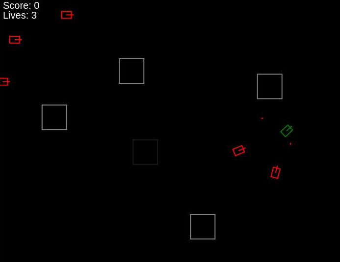

# Battlezone Clone with Obstacles, Terrain Limits, and Sound Effects



Play here: https://ignatmaldive.github.io/battlefield/

Welcome to the **Battlezone Clone**, a retro-style tank game built with JavaScript and HTML5 Canvas. Navigate your tank through a battlefield filled with obstacles, engage enemy tanks, and survive as long as possible while aiming for a high score.

## Table of Contents

- [Features](#features)
- [Gameplay](#gameplay)
- [Getting Started](#getting-started)
  - [Prerequisites](#prerequisites)
  - [Installation](#installation)
  - [Running the Game](#running-the-game)
- [Controls](#controls)
- [Sound Effects](#sound-effects)
- [Customization](#customization)
- [Known Issues](#known-issues)
- [Acknowledgments](#acknowledgments)
- [License](#license)

## Features

- **Player Tank:** Control a tank with smooth movement and shooting mechanics.
- **Enemy Tanks:** AI-controlled enemies that pursue and shoot at the player.
- **Obstacles (Buildings):** Destructible buildings that can be partially destroyed when shot.
- **Terrain Limits:** Visible boundaries outlining the playable area.
- **Sound Effects:** Low-fidelity sounds for shooting, hits, and explosions.
- **Explosions:** Visual effects when tanks or buildings are destroyed.
- **HUD:** Display of the player's score and remaining lives.
- **Game Over Screen:** Displayed when the player loses all lives.

## Gameplay

- Navigate through a battlefield filled with obstacles.
- Destroy enemy tanks to increase your score.
- Avoid enemy fire and collisions with buildings.
- Buildings can be destroyed by shooting them multiple times.
- Survive as long as possible to achieve a high score.

## Getting Started

### Prerequisites

- A modern web browser (Google Chrome, Mozilla Firefox, Microsoft Edge, Safari) with JavaScript enabled.
- Basic understanding of how to run HTML and JavaScript files.
- Sound files (`shoot.wav`, `explosion.wav`, `hit.wav`) placed in the same directory as the `index.html` file.

### Installation

1. **Clone or Download the Repository**

   - Clone the repository using Git:

     ```bash
     git clone https://github.com/yourusername/battlezone-clone.git
     ```

   - Or download the ZIP file from GitHub and extract it to your desired location.

2. **Navigate to the Project Directory**

   ```bash
   cd battlezone-clone
   ```

3. **Add Sound Files**

   - Ensure you have the following sound files in the project directory:
     - `shoot.wav`
     - `explosion.wav`
     - `hit.wav`
   - You can download free sound effects from websites like [Freesound](https://freesound.org/).

### Running the Game

#### Open Directly in Browser

- Open the `index.html` file in your preferred web browser.
  - Right-click on `index.html` and select **Open with** > **Your Browser**.
  - **Note:** Some browsers may restrict local file access for sound files. If you encounter issues with sound, try Option 2.

## Controls

- **Move Forward:** `Arrow Up`
- **Move Backward:** `Arrow Down`
- **Turn Left:** `Arrow Left`
- **Turn Right:** `Arrow Right`
- **Shoot:** `Spacebar`

## Sound Effects

- **Shooting:** Played when the player fires a bullet.
- **Hit:** Played when a bullet hits a building.
- **Explosion:** Played when a building is destroyed, an enemy tank is destroyed, or the player is hit.

**Important:** Ensure that the sound files are correctly named and located in the same directory as `index.html`. The game relies on these files for audio playback.

## Customization

You can modify various aspects of the game by editing the JavaScript code in `index.html`.

### Adjust the Number of Buildings

- Located in the `generateBuildings` function:

  ```javascript
  function generateBuildings() {
      for (let i = 0; i < 5; i++) { // Change the number 5 to increase or decrease buildings
          // Building generation code
      }
  }
  ```

### Change Building Properties

- Modify the `width`, `height`, and `health` properties in the `Building` class:

  ```javascript
  class Building {
      constructor(x, y, width, height, color) {
          // Adjust width and height
          this.width = 50; // Change as desired
          this.height = 50; // Change as desired
          // Adjust health (number of hits the building can take)
          this.health = 5; // Change as desired
      }
      // ...
  }
  ```

### Modify Enemy Behavior

- Adjust the enemy speed in the `EnemyTank` class constructor:

  ```javascript
  class EnemyTank extends GameObject {
      constructor(x, y, color) {
          super(x, y, color);
          this.speed = 0.8; // Increase for faster enemies, decrease for slower
          // ...
      }
      // ...
  }
  ```

- Change the enemy spawn interval:

  ```javascript
  let enemySpawnInterval = setInterval(() => {
      // Enemy spawning code
  }, 3000); // Decrease for more frequent spawns, increase for less frequent
  ```

### Adjust Player Properties

- Change the player's maximum speed or reload time in the `PlayerTank` class:

  ```javascript
  class PlayerTank extends GameObject {
      constructor(x, y, color) {
          super(x, y, color);
          this.maxSpeed = 2; // Adjust for faster or slower movement
          this.reloadTime = 500; // Adjust firing rate (in milliseconds)
          // ...
      }
      // ...
  }
  ```

## Known Issues

- **Sound Restrictions:** Some browsers may block audio playback until the user interacts with the page (e.g., clicks or presses a key).
- **Performance:** On older machines or browsers, performance may degrade with many on-screen objects.

## Acknowledgments

- **Sound Effects:**
  - **Shooting Sound:** [Freesound User - ExampleUser](https://freesound.org/people/ExampleUser/)
  - **Explosion Sound:** [Freesound User - ExampleUser](https://freesound.org/people/ExampleUser/)
  - **Hit Sound:** [Freesound User - ExampleUser](https://freesound.org/people/ExampleUser/)
  - *Please replace `ExampleUser` with the actual usernames of the sound creators if you use their sounds.*

- **Inspiration:**
  - This game is inspired by the classic arcade game **Battlezone** by Atari.

- **Resources:**
  - [MDN Web Docs](https://developer.mozilla.org/) for documentation on JavaScript and Canvas API.
  - [Stack Overflow](https://stackoverflow.com/) for community support and code examples.

## License

This project is licensed under the MIT License - see the [LICENSE](LICENSE) file for details.

---

Enjoy the game! If you have any suggestions or encounter any issues, feel free to open an issue or submit a pull request.

**Happy Gaming!**
